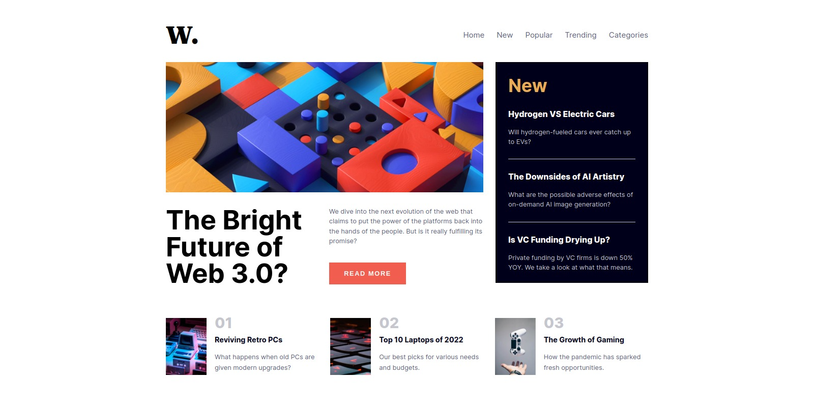

# Frontend Mentor - News homepage solution

This is a solution to the [News homepage challenge on Frontend Mentor](https://www.frontendmentor.io/challenges/news-homepage-H6SWTa1MFl). Frontend Mentor challenges help you improve your coding skills by building realistic projects.

## Table of contents

- [Overview](#overview)
  - [The challenge](#the-challenge)
  - [Screenshot](#screenshot)
  - [Links](#links)
- [My process](#my-process)
  - [Built with](#built-with)
  - [Useful resources](#useful-resources)
- [Author](#author)

## Overview

### The challenge

Users should be able to:

- View the optimal layout for the interface depending on their device's screen size
- See hover and focus states for all interactive elements on the page

### Screenshot

### Links

- Solution URL: https://github.com/tabascum/news-homepage
- Live Site URL: https://tabascum-news-homepage.netlify.app

## My process

### Built with

- Semantic HTML5 markup
- CSS custom properties
- Flexbox
- CSS Grid
- Mobile-first workflow

### Useful resources

- [W3 Schools](https://www.w3schools.com/howto/howto_js_sidenav.asp) - This helped me figure out how to handle a side navigation bar.

## Author

- Frontend Mentor - [@tabascum](https://www.frontendmentor.io/profile/tabascum)
- LinkedIn - [@VascoDMarques](https://www.linkedin.com/in/vascodmarques/)
